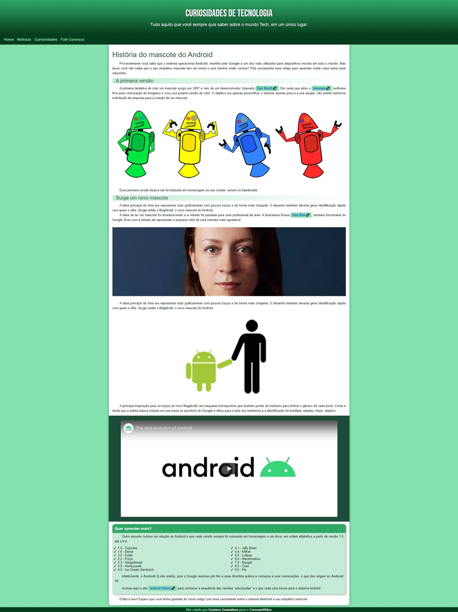

# Desafio Miniprojeto
Mini projeto da serie de videos do Guanabara sobre <strong>HTML</strong> e <strong>CSS</strong>. Pratiquei a utilização de variáveis no CSS e toda construção de forma responsiva.

<h1>Página desktop</h1>

<h1>Página mobile</h1>

